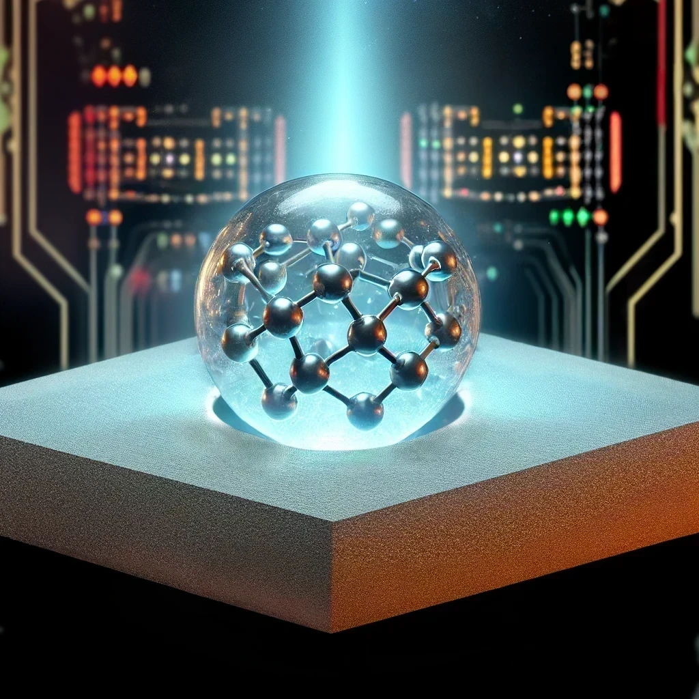

# iGAM-MSI

iGAM-MSI: Shed light on Metal-Support Interactions through Interpretable Machine Learning (Glass-box model)

## Table of Contents
- [Introduction](#introduction)
- [Features](#features)
- [Prerequisites](#prerequisites)
- [Dependencies](#dependencies)
- [References](#references)
- [Citation](#citation)

## Introduction

In the realm of materials science, understanding is light. iGAM-MSI illuminates the complex world of Metal-Support Interactions (MSI) using Interpretable Generalized Additive Models (iGAM).

iGAM-MSI is an open-source project that leverages the power of iGAM to provide accurate and explainable predictions in materials science. With this package, you can train interpretable glassbox models and explain the intricacies of MSI systems. iGAM-MSI helps you understand your model's global behavior, or unravel the reasons behind individual predictions.

### Why Interpretability Matters in MSI Research

Interpretability in MSI research is essential for:

- **Model Debugging**: Understand why your model made specific predictions about metal-support interactions
- **Feature Engineering**: Identify ways to improve your model for better MSI phenomena capture
- **Material Design**: Leverage insights to design superior catalysts and supported metal systems
- **Scientific Discovery**: Uncover new insights about MSI through interpretable models

## Features

- Well-established iGAM models:
  - 12-features iGAM
  - 6-features iGAM
- Automated feature extraction workflow code

## Prerequisites

- Python 3.7+
  
## Dependencies

This project requires the following main Python libraries:

- NumPy
- SciPy
- pandas
- ASE (Atomic Simulation Environment)
- scikit-learn
- scikit-optimize
- interpret-community
- matplotlib
- tqdm
- minepy
- statsmodels
- alive-progress

Note: Some libraries like `interpret-community` might have additional system dependencies. Please refer to their respective documentation for complete installation instructions.

## References

For a detailed overview of iGAMs, please refer to the [original EBM repository](https://github.com/interpretml/interpret/).

## Citation

If you use this code, models, or the NN-MD-database in your research, please cite:

> Jiang C, Yan B, Goldsmith B, Linic S. *Predictive model for the discovery of sinter-resistant supports for metallic nanoparticle catalysts by interpretable machine learning*. Nat Catal (2025).

